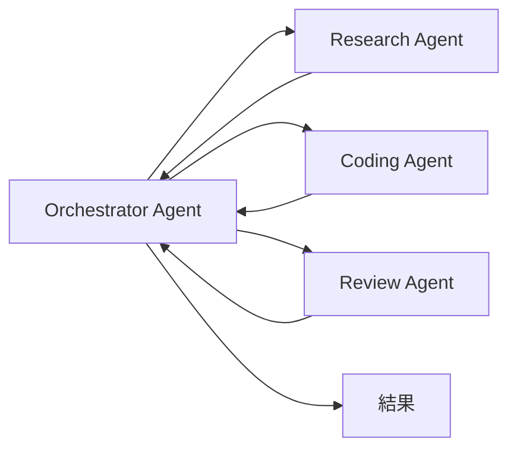

# 核心概念

[[AI 101 - 主頁|← 回主頁]]

---

## LLM（Large Language Model）

大型語言模型。GPT、Claude、Gemini 都是 LLM。

- 本質是預測「下一個 token」的機率模型
- 不是真的「懂」，而是從海量文字中學到統計規律
- **Context Window**：一次能讀入的文字上限（Claude 3.5 約 200K tokens）

> [!info] Token 是什麼？
> 大約 0.75 個英文單字 = 1 token；中文約 1 個字 = 1-2 tokens。
> 200K tokens ≈ 約 15 萬中文字 ≈ 一本小說

---

## Prompt

你給 AI 的輸入指令。

| 類型 | 說明 | 範例 |
|---|---|---|
| **System Prompt** | 定義 AI 的角色與行為規則 | "你是一個資深工程師..." |
| **User Prompt** | 使用者的每次輸入 | "幫我 review 這段程式碼" |
| **Few-shot** | 在 prompt 中給範例讓 AI 學習格式 | 給 3 個輸入/輸出範例 |

---

## Prompt Engineering

寫出好 prompt 的技巧，讓 AI 輸出更準確。

**常見技巧：**
- **Chain of Thought**：叫 AI「一步一步思考」，提升推理準確度
- **Role Prompting**：給 AI 角色設定（"你是一個資安專家"）
- **Constraints**：明確限制輸出格式（"用 JSON 回答"、"不超過 100 字"）
- **Few-shot**：給範例讓 AI 理解你要的格式

> [!warning] Prompt Engineering 的限制
> Prompt 只是 AI 接收資訊的 5%。真正影響結果的是整體 **Context**。
> 詳見 [[AI 101 - Context Engineering]]

---

## Agent（代理人）

不只回答問題，而是能**自主規劃、使用工具、執行多步驟任務**的 AI 系統。

```
傳統 AI：問 → 答
Agent：目標 → 規劃 → 工具呼叫 → 執行 → 檢查 → 完成
```

**Agent 的關鍵能力：**
- 使用工具（搜尋、寫程式、操作檔案）
- 記憶跨步驟的狀態
- 自我修正錯誤
- 必要時拆解子任務

---

## Multi-agent

多個 AI agent 協作完成任務，各自負責不同專業。



**優點：**
- 每個 agent 專注在自己擅長的事
- 平行處理，速度更快
- Context 不互相污染

---

## RAG（Retrieval-Augmented Generation）

讓 AI 在回答前先查詢外部知識庫，再結合查到的資料生成回答。

**解決的問題：**
- AI 知識有截止日期（knowledge cutoff）
- AI 不知道你的私有資料（公司文件、程式碼庫）
- 減少「幻覺」（hallucination）

```
使用者問題 → 向量搜尋相關文件 → 把文件 + 問題一起給 AI → 有依據的回答
```

---

## 幻覺（Hallucination）

AI 以自信的語氣說出**不存在或錯誤的事實**。

> [!warning] 常見情境
> - 引用不存在的論文
> - 虛構的 API 函式名稱
> - 錯誤的歷史事件日期

**如何減少：**
- 用 RAG 提供真實資料來源
- 要求 AI「若不確定請說不知道」
- 要求附上來源連結
- 重要資訊務必自行驗證

---

## Fine-tuning vs Prompting

| | Fine-tuning | Prompting |
|---|---|---|
| **方式** | 用資料重新訓練模型 | 用文字指令調整行為 |
| **成本** | 高（需要 GPU、資料） | 低（直接使用） |
| **彈性** | 低（訓練完就固定） | 高（隨時修改） |
| **適合** | 固定風格、特定領域 | 大多數使用場景 |

> [!tip] 2026 年建議
> 大多數情況先嘗試 Prompt Engineering + RAG，效果通常已經足夠，不需要 Fine-tuning。

---

## 相關筆記

- [[AI 101 - Context Engineering]] — 比 Prompt Engineering 更重要的技能
- [[AI 101 - Claude Code 生態系]] — 實際工具使用
