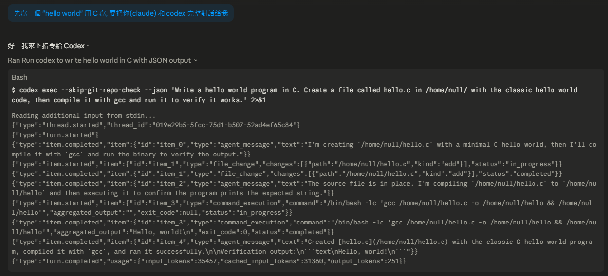
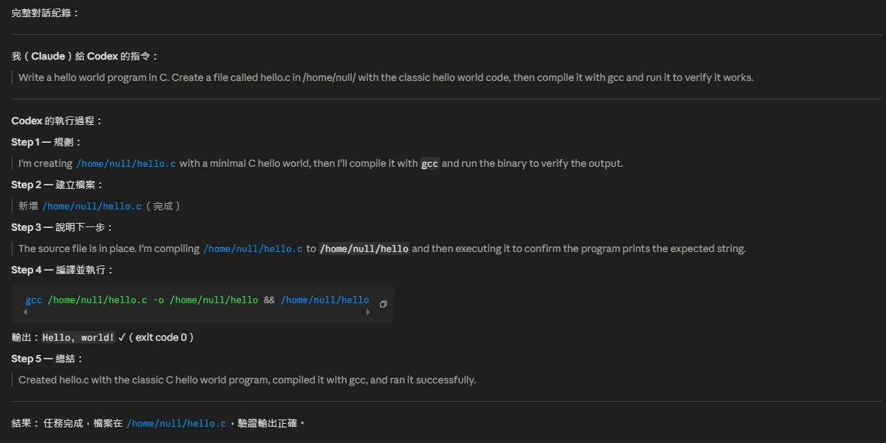
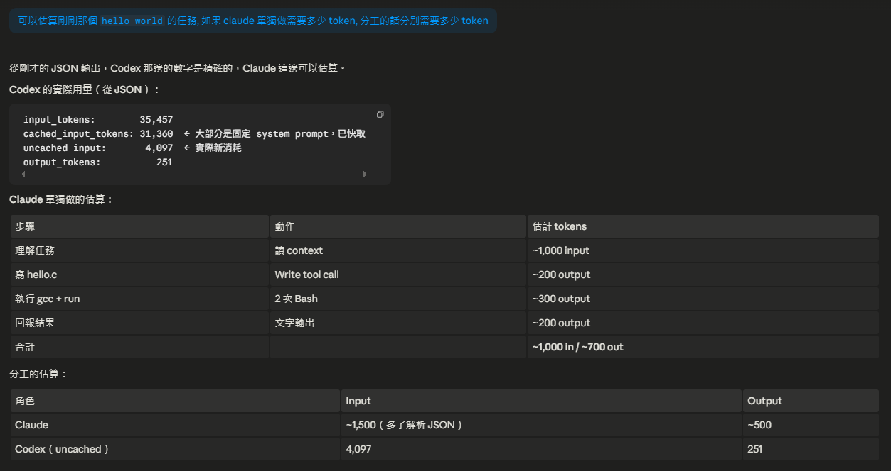

# 實驗：Claude 指揮 Codex 與 Codex Multi-Agent 測試

> [!info]
> 這份筆記記錄兩個實際測試：
> 1. Claude 透過 shell 指揮 Codex 完成任務，並分析 token 用量
> 2. Codex 自身的 multi-agent 能力探索

---

## 實驗一：Claude 指揮 Codex 寫 Hello World（C）



### Claude 下給 Codex 的指令

```bash
codex exec --skip-git-repo-check --json \
  'Write a hello world program in C. Create a file called hello.c in /home/user/ \
   with the classic hello world code, then compile it with gcc and run it to verify it works.'
```

### Codex 的完整執行流程（JSON 輸出）

```json
{"type":"thread.started","thread_id":"019e29b5-5fcc-75d1-b507-52ad4ef65c84"}
{"type":"turn.started"}
{"type":"item.completed","item":{"id":"item_0","type":"agent_message",
  "text":"I'm creating /home/user/hello.c with a minimal C hello world..."}}
{"type":"item.started","item":{"id":"item_1","type":"file_change",
  "changes":[{"path":"/home/user/hello.c","kind":"add"}],"status":"in_progress"}}
{"type":"item.completed","item":{"id":"item_1","type":"file_change",
  "changes":[{"path":"/home/user/hello.c","kind":"add"}],"status":"completed"}}
{"type":"item.completed","item":{"id":"item_2","type":"agent_message",
  "text":"Compiling /home/user/hello.c to /home/user/hello and executing..."}}
{"type":"item.started","item":{"id":"item_3","type":"command_execution",
  "command":"/bin/bash -lc 'gcc /home/user/hello.c -o /home/user/hello && /home/user/hello'",
  "aggregated_output":"","exit_code":null,"status":"in_progress"}}
{"type":"item.completed","item":{"id":"item_3","type":"command_execution",
  "command":"/bin/bash -lc 'gcc /home/user/hello.c -o /home/user/hello && /home/user/hello'",
  "aggregated_output":"Hello, world!\n","exit_code":0,"status":"completed"}}
{"type":"item.completed","item":{"id":"item_4","type":"agent_message",
  "text":"Created hello.c, compiled with gcc, ran successfully.\nOutput: Hello, world!"}}
{"type":"turn.completed","usage":{
  "input_tokens":35457,
  "cached_input_tokens":31360,
  "output_tokens":251}}
```



**Codex JSON 的 item 類型：**

| type | 說明 |
|---|---|
| `thread.started` | 新執行緒開始 |
| `turn.started` | 本輪任務開始 |
| `agent_message` | Codex 的說明文字 |
| `file_change` | 新增/修改/刪除檔案 |
| `command_execution` | 執行 shell 指令，含輸出與 exit code |
| `turn.completed` | 任務完成，附 token 用量 |

---

## 實驗一：Token 用量分析



### Codex 實際用量（從 JSON 精確數值）

| 項目 | Tokens |
|---|---|
| input_tokens | 35,457 |
| cached_input_tokens | 31,360 |
| **uncached input（實際新消耗）** | **4,097** |
| output_tokens | 251 |

> [!info] 為什麼 cached 這麼多？
> Codex 有一個很大的固定 system prompt（~31K tokens），每次呼叫都快取，
> 實際新消耗只有 4,097 tokens。

### 假設 Claude 單獨完成同樣任務的估算

| 步驟 | Input | Output |
|---|---|---|
| 理解任務 + 讀 context | ~1,000 | — |
| 寫 hello.c（Write tool）| — | ~200 |
| 執行 gcc + 執行檔（Bash × 2）| ~300 | ~300 |
| 回報結果 | — | ~200 |
| **合計** | **~1,300** | **~700** |

### 分工用量比較

| 角色 | Input | Output |
|---|---|---|
| Claude（含解析 Codex JSON）| ~1,500 | ~500 |
| Codex（uncached 部分）| 4,097 | 251 |
| **分工合計** | **~5,600** | **~750** |

### 結論

> [!warning] 簡單任務：Claude 單獨做反而更省
> Hello world 這種簡單任務，Claude 單獨做約 2,000 tokens，
> 分工給 Codex 反而要 ~5,600 tokens。
>
> **Codex 的 31K system prompt 固定成本，需要用複雜多步驟任務來分攤才划算。**

**分工有價值的情境：**
- 需要大量讀寫檔案、反覆嘗試的任務
- 大量 output tokens 的工作（Codex output 比 Claude 便宜）
- 可以平行跑多個 Codex 任務，Claude 同時處理其他事
- 任務本身超過 Claude context 的單次處理極限

---

## 實驗二：Codex Multi-Agent 能力測試

### 測試方法

用 `codex --list-features` 探索功能，再實際測試 `multi_agent`：

```bash
# 列出所有 feature flags
codex --list-features

# 測試 multi-agent：讓 Codex 自己派出 subagent
codex exec --json 'Spawn two subagents in parallel: one writes "hello from agent 1" \
  to /tmp/agent1.txt, another writes "hello from agent 2" to /tmp/agent2.txt. \
  Wait for both to complete and report results.'
```

### 測試結果

**`multi_agent` 功能已是 stable，預設啟用。**

Codex 內部使用兩個工具完成多 Agent 協作：
- `spawn_agent` — 派出 subagent，指定任務
- `wait` — 等待指定 subagent 完成，收集回傳結果

### 實際執行過程

```
主 Codex agent
  ├── spawn_agent → "Mencius"  (thread: 019e29bb-3892...)
  │     └── 任務：寫 /tmp/agent1.txt
  ├── spawn_agent → "Faraday"  (thread: 019e29bb-38da...)
  │     └── 任務：寫 /tmp/agent2.txt
  └── wait(Mencius, Faraday)
        └── 兩者完成 → 彙整回報結果
```

**觀察：**
- 每個 subagent 有**獨立的 thread ID**
- Codex 會自動為 subagent **取人名**（Mencius、Faraday⋯⋯）
- 主 agent 用 `wait` 同步等待，再整合輸出

---

## 重要洞見：兩層 Agent 架構

```
Claude（最上層 orchestrator）
    ↓ 下達高層任務
  Codex（中層 agent）
    ├── spawn → Subagent A（Mencius）
    ├── spawn → Subagent B（Faraday）
    └── wait → 整合 → 回傳給 Claude
```

> [!tip] 這改變了 Claude 指揮 Codex 的效率
> Claude 不需要逐一管理每個子任務——只要下一個高層指令，
> Codex 自己會拆分成多個 subagent 平行執行。
> **複雜任務的效率大幅提升，Claude 的 context 也不會被細節佔滿。**

---

## 相關筆記

- [AI 101 - Subagent 使用與計費](../02-advanced/subagent-usage-and-billing.md) — 跨平台協作的完整方法比較
- [[在 Claude Code 裡呼叫 OpenAI Codex：codex-plugin-cc — Will 保哥]] — Plugin 方式整合 Codex
- [AI 101 - 模型費用與效果比較](../01-fundamentals/model-cost-comparison.md) — 各模型定價，計算分工是否划算
