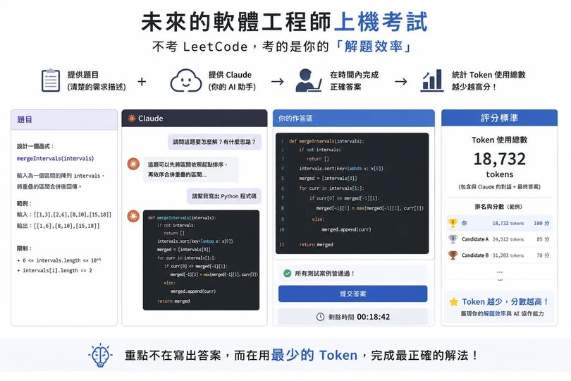

# 未來工程師考試改考 Token 效率

> [!info]
> 原文：[Facebook 貼文](https://www.facebook.com/druidcub/posts/pfbid02VuiXgZg5xSANu5JE9FpVJGKiWxZ4VNkGte5zeY8HahStXSEYT84noVKmaUanbESPl)
> **一句話：** 幽默預測未來工程師面試不考 LeetCode，改考「用 Claude 解題，token 用越少分數越高」。

---

## 核心觀點

作者預測未來軟體工程師招募考試的形式：

> 「給你 Claude 和一個題目，在時間內完成正確答案，再統計 token 用量，token 用越少分數越高。」

這個預測的含義：AI 工具普及後，工程師的核心競爭力從「自己寫程式的速度」轉向「有效率地使用 AI 工具的能力」，而 token efficiency 成為可量化的指標。

---

## 留言反應

- 部分人擔心工作保障
- 有人開玩笑說「不用 AI 寫 zero tokens，直接滿分」
- 有人質疑強制指定 Claude 是否公平（類似考試強制規定程式語言）

---

## 相關筆記

- [[AI 101 - Subagent 使用與計費]] — token 計費結構

## 來源

- 原文：[Facebook — 曾冠傑](https://www.facebook.com/druidcub/posts/pfbid02VuiXgZg5xSANu5JE9FpVJGKiWxZ4VNkGte5zeY8HahStXSEYT84noVKmaUanbESPl)
