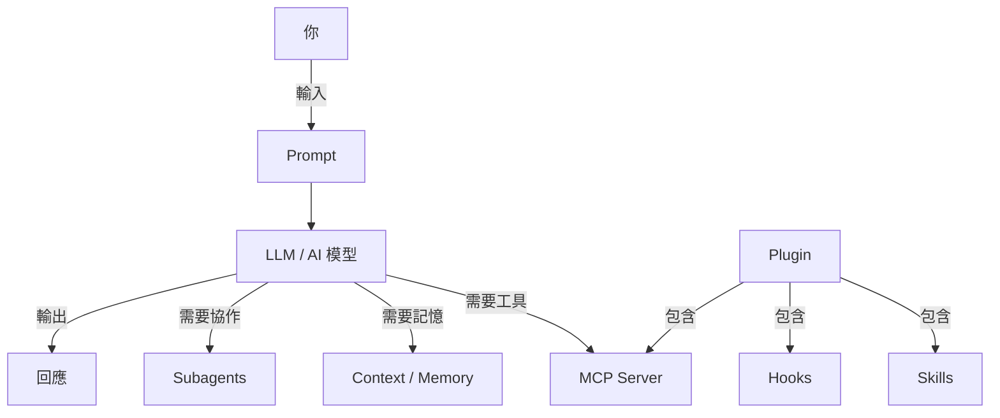

# AI 101 — 聰明使用 AI 的完整指南

> [!quote]
> "Prompt engineering 只是開始，2026 年真正的技能叫做 **Context Engineering**。"

## 這份筆記是什麼

一份**從零開始、面向實際使用**的 AI 知識地圖。
核心原則：**有清楚概念，又能快速上手。**

每一份筆記都確保你讀完能做到兩件事：

1. **清楚概念** — 理解「這是什麼、為什麼重要」
2. **快速上手** — 能立刻照著做，不需要再查其他資料

---

## 🎯 從這裡開始

> [!tip] 不確定從哪讀？
> 依照你的目標挑一條路：

| 我想⋯ | 建議閱讀順序 |
|---|---|
| **理解基本名詞** | [[AI 101 - 核心概念]] → [[AI 101 - 實用技巧與最佳實踐]] |
| **開始用 Claude Code** | [[AI 101 - 核心概念]] → [[AI 101 - Claude Code 生態系]] → [[AI 101 - 實用技巧與最佳實踐]] |
| **學 2026 最關鍵技能** | [[AI 101 - Context Engineering]] → [[AI 101 - Harness Engineering]] |
| **跑本地模型（離線、隱私）** | [[AI 101 - Ollama 指令教學]] → [[AI 101 - 輕量模型推薦]] → [[AI 101 - Gemma 4 本地模型]] |
| **架自己的 AI Agent** | [[AI 101 - OpenClaw]] 或 [[AI 101 - Hermes Agent]] |
| **挑最划算的 AI 模型** | [[AI 101 - 模型費用與效果比較]] |

---

## 📚 基礎概念（建議先讀）

建立對 AI 的正確心智模型，後面所有內容都建立在這裡。

| 筆記 | 你會學到 |
|---|---|
| [[AI 101 - 核心概念]] | Agent、LLM、RAG、幻覺、MCP、Subagents 等基礎詞彙 |
| [[AI 101 - Claude Code 生態系]] | Skills、Hooks、MCP、Plugins、Subagents 的關係與差異 |
| [[AI 101 - 實用技巧與最佳實踐]] | 提升效率的具體方法與工作流 |
| [[AI 101 - 模型費用與效果比較]] | 各家模型定價、benchmark、如何挑到 CP 值最高的 |

---

## 🧠 進階觀念（想把 AI 用到極致）

從「會用」進化到「用得好」的關鍵思維。

| 筆記 | 你會學到 |
|---|---|
| [[AI 101 - Context Engineering]] | 2026 最重要的技能：Prompt 只是 5%，Context 才是 95% |
| [[AI 101 - Harness Engineering]] | 70% 的 AI 效能來自外層框架而不是模型本身 |
| [[AI 101 - ML 演算法精要]] | Isolation Forest、Random Forest、XGBoost、PELT、LSTM、HMM 核心觀念與程式碼 |

---

## 🛠️ AI 工具（選你需要的）

具體可以馬上安裝使用的工具。按用途分類：

### 個人 AI Agent

| 工具 | 特色 |
|---|---|
| [[AI 101 - OpenClaw]] | 自架式 AI 閘道器，串接 LINE/Discord/Slack 等通訊平台 |
| [[AI 101 - Hermes Agent]] | 開源個人 AI 助理，持久記憶 + 自我進化 Skills |

### Claude Code 擴充

| 工具 | 特色 |
|---|---|
| [[AI 101 - 女媧 Nuwa Skill]] | 蒸餾公眾人物思維框架的 Skill |
| [[AI 101 - Better Agent Terminal]] | 整合終端機 + Claude Agent + 開發工具的 Electron 桌面應用 |
| [[AI 101 - PII Masking（隱私遮蔽）]] | 自動偵測並遮蔽文字中的個人資料（GDPR 合規、送 LLM 前過濾）|
| [[AI 101 - Claude × Godot 遊戲開發]] | 用 Claude Code + MCP + GUT 開發 Godot 遊戲並自動化測試 |

---

## 🤖 本地 LLM 模型（離線、隱私、免費）

想讓 AI 跑在自己機器上、不上雲端，從這條路線開始。

| 筆記 | 你會學到 |
|---|---|
| [[AI 101 - Ollama 指令教學]] | 一行裝好、管理模型、開區網存取 |
| [[AI 101 - 輕量模型推薦]] | 8GB / 16GB / 32GB VRAM 分級選型 |
| [[AI 101 - Gemma 4 本地模型]] | Google 最新開源模型，接 OpenClaw / Hermes 完全離線 |

**建議順序：** 先把 Ollama 裝好 → 挑一個適合你硬體的模型 → 有興趣再深入 Gemma 4。

---

## 快速概念地圖

---

## 2026 年最值得關注的趨勢

> [!tip] 重點趨勢
> 1. **Context Engineering** 取代 Prompt Engineering 成為核心技能
> 2. **MCP** 成為 AI 工具整合標準協議（AI 的 USB-C）
> 3. **Multi-agent** 架構普及，AI 開始協作分工
> 4. **Agentic AI** 從問答走向自主完成多步驟任務
> 5. **本地 LLM** 品質逼近雲端，隱私與成本優勢明顯

---

## 相關資源

- [Anthropic Engineering Blog](https://www.anthropic.com/engineering)
- [Claude Code 官方文件](https://code.claude.com/docs)
- [MCP 規範](https://modelcontextprotocol.io)
- [Ollama 官網](https://ollama.com)
