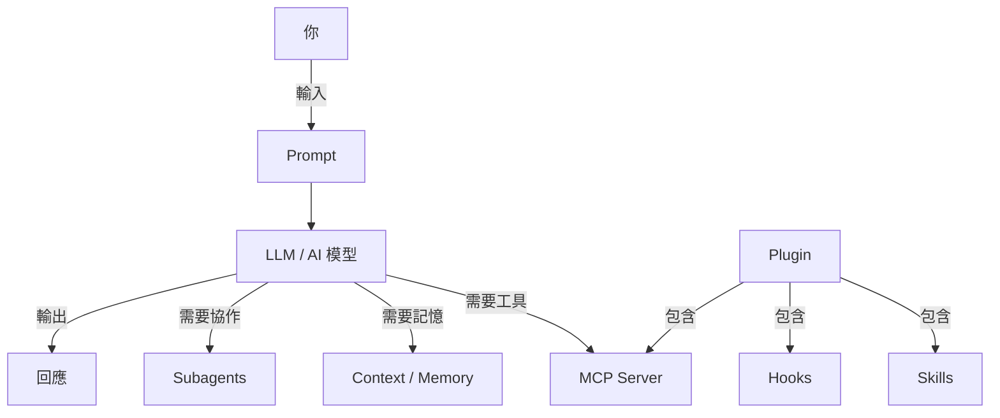

# AI 101 — 聰明使用 AI 的完整指南

> [!quote]
> "Prompt engineering 只是開始，2026 年真正的技能叫做 **Context Engineering**。"

## 這份筆記是什麼

一份從零開始、面向實際使用的 AI 知識地圖。不只介紹概念，更著重**你能怎麼用**。

---

## 目錄

| 主題 | 說明 |
|---|---|
| [[AI 101 - 核心概念]] | Agent、LLM、RAG、幻覺等基礎詞彙 |
| [[AI 101 - Claude Code 生態系]] | Skills、Hooks、MCP、Plugins、Subagents |
| [[AI 101 - Context Engineering]] | 2026 最重要的 AI 技能詳解 |
| [[AI 101 - 實用技巧與最佳實踐]] | 提升效率的具體方法與工作流 |
| [[AI 101 - OpenClaw]] | 自架式 AI Agent 閘道器，串接各通訊平台 |
| [[AI 101 - Hermes Agent]] | 開源個人 AI 助理，持久記憶 + 自我進化 Skills |
| [[AI 101 - Harness Engineering]] | 包裹 LLM 的完整執行基礎設施設計 |
| [[AI 101 - Gemma 4 本地模型]] | Google 開源模型，接上 OpenClaw / Hermes Agent 完全離線跑 |

---

## 快速概念地圖

---

## 2026 年最值得關注的趨勢

> [!tip] 重點趨勢
> 1. **Context Engineering** 取代 Prompt Engineering 成為核心技能
> 2. **MCP** 成為 AI 工具整合標準協議（AI 的 USB-C）
> 3. **Multi-agent** 架構普及，AI 開始協作分工
> 4. **Agentic AI** 從問答走向自主完成多步驟任務

---

## 相關資源

- [Anthropic Engineering Blog](https://www.anthropic.com/engineering)
- [Claude Code 官方文件](https://code.claude.com/docs)
- [MCP 規範](https://modelcontextprotocol.io)
