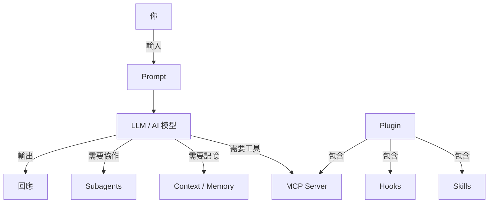

# AI 101 — 聰明使用 AI 的完整指南

> "Prompt engineering 只是開始，2026 年真正的技能叫做 **Context Engineering**。"

## 這份筆記是什麼

一份**從零開始、面向實際使用**的 AI 知識地圖。
核心原則：**有清楚概念，又能快速上手。**

每一份筆記都確保你讀完能做到兩件事：

1. **清楚概念** — 理解「這是什麼、為什麼重要」
2. **快速上手** — 能立刻照著做，不需要再查其他資料

---

## 🎯 從這裡開始

> [!TIP] 不確定從哪讀？
> 依照你的目標挑一條路：

| 我想⋯ | 建議閱讀順序 |
|---|---|
| **理解基本名詞** | [AI 101 - 核心概念](./01-基礎概念/AI%20101%20-%20核心概念.md) → [AI 101 - 實用技巧與最佳實踐](./01-基礎概念/AI%20101%20-%20實用技巧與最佳實踐.md) |
| **開始用 Claude Code** | [AI 101 - 核心概念](./01-基礎概念/AI%20101%20-%20核心概念.md) → [AI 101 - Claude Code 生態系](./01-基礎概念/AI%20101%20-%20Claude%20Code%20生態系.md) → [AI 101 - 實用技巧與最佳實踐](./01-基礎概念/AI%20101%20-%20實用技巧與最佳實踐.md) |
| **學 2026 最關鍵技能** | [AI 101 - Context Engineering](./02-進階觀念/AI%20101%20-%20Context%20Engineering.md) → [AI 101 - Harness Engineering](./02-進階觀念/AI%20101%20-%20Harness%20Engineering.md) |
| **跑本地模型（離線、隱私）** | [AI 101 - Ollama 指令教學](./04-本地LLM/AI%20101%20-%20Ollama%20指令教學.md) → [AI 101 - 輕量模型推薦](./04-本地LLM/AI%20101%20-%20輕量模型推薦.md) → [AI 101 - Gemma 4 本地模型](./04-本地LLM/AI%20101%20-%20Gemma%204%20本地模型.md) |
| **架自己的 AI Agent** | [AI 101 - OpenClaw](./03-AI工具/AI%20101%20-%20OpenClaw.md) 或 [AI 101 - Hermes Agent](./03-AI工具/AI%20101%20-%20Hermes%20Agent.md) |
| **挑最划算的 AI 模型** | [AI 101 - 模型費用與效果比較](./01-基礎概念/AI%20101%20-%20模型費用與效果比較.md) |

---

## 📚 基礎概念（建議先讀）

建立對 AI 的正確心智模型，後面所有內容都建立在這裡。

| 筆記 | 你會學到 |
|---|---|
| [AI 101 - 核心概念](./01-基礎概念/AI%20101%20-%20核心概念.md) | Agent、LLM、RAG、幻覺、MCP、Subagents 等基礎詞彙 |
| [AI 101 - Claude Code 生態系](./01-基礎概念/AI%20101%20-%20Claude%20Code%20生態系.md) | Skills、Hooks、MCP、Plugins、Subagents 的關係與差異 |
| [AI 101 - Claude Code goal](./01-基礎概念/AI%20101%20-%20Claude%20Code%20goal.md) | `/goal` 設定完成條件讓 Claude 自動執行到達成，無人值守的關鍵功能 |
| [AI 101 - Claude Code 行為結構設計](./01-基礎概念/AI%20101%20-%20Claude%20Code%20行為結構設計.md) | `/goal`、Sub-agents、Skills、Hooks 四層設計 AI 行為，含 Hello World 範例與驗證步驟 |
| [AI 101 - Claude Code goal 強制力 Hook](./01-基礎概念/AI%20101%20-%20Claude%20Code%20goal%20強制力%20Hook.md) | Stop / UserPromptSubmit / PreToolUse / PreCompact 五種 hook 讓 `/goal` 不達標不停手 |
| [AI 101 - Claude Code Workflow × goal 混用](./01-基礎概念/AI%20101%20-%20Claude%20Code%20Workflow%20×%20goal%20混用.md) | Dynamic Workflows（廣度）和 `/goal`（深度）怎麼組合，五種實用 pattern 與陷阱 |
| [AI 101 - Claude Code chrome 瀏覽器整合](./01-基礎概念/AI%20101%20-%20Claude%20Code%20chrome%20瀏覽器整合.md) | `--chrome` 讓 Claude 直接控制瀏覽器（截圖、點擊、填表、讀 console），安裝與排查 |
| [AI 101 - Claude Code chrome 進階操作](./01-基礎概念/AI%20101%20-%20Claude%20Code%20chrome%20進階操作.md) | 多瀏覽器管理、Tab Group 生命週期、`browser_batch` 效能優化、完整工具清單 |
| [AI 101 - Claude Code 權限模式與設定層級](./01-基礎概念/AI%20101%20-%20Claude%20Code%20權限模式與設定層級.md) | 五種權限模式（Plan / Default / Accept edits / Auto / Don't ask）風險對照，四層設定誰蓋過誰，企業 policy 為何改不動 |
| [AI 101 - 實用技巧與最佳實踐](./01-基礎概念/AI%20101%20-%20實用技巧與最佳實踐.md) | 提升效率的具體方法與工作流 |
| [AI 101 - 模型費用與效果比較](./01-基礎概念/AI%20101%20-%20模型費用與效果比較.md) | 各家模型定價、benchmark、如何挑到 CP 值最高的 |
| [AI 101 - v1 chat completions curl Cheatsheet](./01-基礎概念/AI%20101%20-%20v1%20chat%20completions%20curl%20Cheatsheet.md) | 業界通用 LLM API 格式的 curl 完全指南：streaming、tool use、vision、JSON mode、各大供應商切換 |
| [AI 101 - OpenAI API 完整端點速查](./01-基礎概念/AI%20101%20-%20OpenAI%20API%20完整端點速查.md) | `/v1/chat/completions` 之外的所有重要端點：Embeddings、Batch（省 50%）、Whisper、TTS、Images、Moderations、Responses API |

---

## 🧠 進階觀念（想把 AI 用到極致）

從「會用」進化到「用得好」的關鍵思維。

| 筆記 | 你會學到 |
|---|---|
| [AI 101 - AI 能力全景圖](./02-進階觀念/AI%20101%20-%20AI%20能力全景圖.md) | 用「資訊流向 × 認知深度」兩軸把 AI 能力攤成一張圖，看出忠實度梯度與自己的使用盲區 |
| [AI 101 - Context Engineering](./02-進階觀念/AI%20101%20-%20Context%20Engineering.md) | 2026 最重要的技能：Prompt 只是 5%，Context 才是 95% |
| [AI 101 - Harness Engineering](./02-進階觀念/AI%20101%20-%20Harness%20Engineering.md) | 70% 的 AI 效能來自外層框架而不是模型本身 |
| [AI 101 - ML 演算法精要](./02-進階觀念/AI%20101%20-%20ML%20演算法精要.md) | Isolation Forest、Random Forest、XGBoost、PELT、LSTM、HMM 核心觀念與程式碼 |
| [AI 101 - Subagent 使用與計費](./02-進階觀念/AI%20101%20-%20Subagent%20使用與計費.md) | Orchestrator 模式、並行 subagent、API 計費結構與省錢策略 |

---

## 🛠️ AI 工具（選你需要的）

具體可以馬上安裝使用的工具。按用途分類：

### AI 模型平台

| 工具 | 特色 |
|---|---|
| [AI 101 - Mistral AI](./03-AI工具/AI%20101%20-%20Mistral%20AI.md) | 法國開源 AI 平台，MoE 架構、Apache 2.0、雲端 + 自架皆支援 |

### 個人 AI Agent

| 工具 | 特色 |
|---|---|
| [AI 101 - OpenClaw](./03-AI工具/AI%20101%20-%20OpenClaw.md) | 自架式 AI 閘道器，串接 LINE/Discord/Slack 等通訊平台 |
| [AI 101 - Hermes Agent](./03-AI工具/AI%20101%20-%20Hermes%20Agent.md) | 開源個人 AI 助理，持久記憶 + 自我進化 Skills |

### Claude Code 擴充

| 工具 | 特色 |
|---|---|
| [AI 101 - 女媧 Nuwa Skill](./03-AI工具/AI%20101%20-%20女媧%20Nuwa%20Skill.md) | 蒸餾公眾人物思維框架的 Skill |
| [AI 101 - Better Agent Terminal](./03-AI工具/AI%20101%20-%20Better%20Agent%20Terminal.md) | 整合終端機 + Claude Agent + 開發工具的 Electron 桌面應用 |
| [AI 101 - PII Masking（隱私遮蔽）](./03-AI工具/AI%20101%20-%20PII%20Masking（隱私遮蔽）.md) | ai4privacy 套件：自動偵測並遮蔽個人資料（50+ 類別、送 LLM 前過濾）|
| [AI 101 - OpenAI Privacy Filter](./03-AI工具/AI%20101%20-%20OpenAI%20Privacy%20Filter.md) | OpenAI 官方開源 PII 模型，本地執行，F1 97%，128K context，Apache 2.0 |
| [AI 101 - Claude × Godot 遊戲開發](./03-AI工具/AI%20101%20-%20Claude%20×%20Godot%20遊戲開發.md) | 用 Claude Code + MCP + GUT 開發 Godot 遊戲並自動化測試 |
| [AI 101 - JT Live Whisper（即時語音轉錄）](./03-AI工具/AI%20101%20-%20JT%20Live%20Whisper（即時語音轉錄）.md) | 本地即時語音轉錄、翻譯、講者辨識、會議摘要，完全不上雲 |
| [AI 101 - OpenCode.ai](./03-AI工具/AI%20101%20-%20OpenCode.ai.md) | Claude Code 的開源替代，支援 75+ 模型，可接 Ollama 完全免費 |

### AI 資安工具

| 工具 | 特色 |
|---|---|
| [AI 101 - BoxPwnr](./03-AI工具/AI%20101%20-%20BoxPwnr.md) | AI 自動化 CTF/HTB 解題框架，Docker + 多 LLM，支援 15+ 平台、進度中斷續跑 |
| [AI 101 - AI 自主滲透測試工具比較](./03-AI工具/AI%20101%20-%20AI%20自主滲透測試工具比較.md) | BoxPwnr / PentestGPT / CTF-Agent / FlagForge 比較，含哪些工具 Claude Max 可用 |
| [AI 101 - Pentest Swarm AI](./03-AI工具/AI%20101%20-%20Pentest%20Swarm%20AI.md) | 群體智慧架構的自主滲透測試平台，Go + Claude API，AGPL-3.0 |
| [AI 101 - HexStrike AI](./03-AI工具/AI%20101%20-%20HexStrike%20AI.md) | MCP Server 橋接 150+ 資安工具，讓 Claude / GPT 直接執行滲透測試 |
| [AI 101 - Viper](./03-AI工具/AI%20101%20-%20Viper.md) | 開源紅隊 C2 框架，內建 LLM Agent，Cobalt Strike 免費替代方案 |

---

## 🤖 本地 LLM 模型（離線、隱私、免費）

想讓 AI 跑在自己機器上、不上雲端，從這條路線開始。

| 筆記 | 你會學到 |
|---|---|
| [AI 101 - Ollama 指令教學](./04-本地LLM/AI%20101%20-%20Ollama%20指令教學.md) | 一行裝好、管理模型、開區網存取 |
| [AI 101 - 輕量模型推薦](./04-本地LLM/AI%20101%20-%20輕量模型推薦.md) | 8GB / 16GB / 32GB VRAM 分級選型 |
| [AI 101 - Gemma 4 本地模型](./04-本地LLM/AI%20101%20-%20Gemma%204%20本地模型.md) | Google 最新開源模型，接 OpenClaw / Hermes 完全離線 |
| [AI 101 - vLLM](./04-本地LLM/AI%20101%20-%20vLLM.md) | 高吞吐量推論伺服器，OpenAI 相容 API，比 HF Transformers 快 14–24x |

**建議順序：** 先把 Ollama 裝好 → 挑一個適合你硬體的模型 → 需要對外提供 API 再看 vLLM。

---

## 快速概念地圖

```mermaid
graph TD
    A[你] -->|輸入| B[Prompt]
    B --> C[LLM / AI 模型]
    C -->|需要工具| D[MCP Server]
    C -->|需要記憶| E[Context / Memory]
    C -->|需要協作| F[Subagents]
    C -->|輸出| G[回應]

    H[Plugin] -->|包含| I[Skills]
    H -->|包含| J[Hooks]
    H -->|包含| D
```

---

## 2026 年最值得關注的趨勢

> [!TIP] 重點趨勢
> 1. **Context Engineering** 取代 Prompt Engineering 成為核心技能
> 2. **MCP** 成為 AI 工具整合標準協議（AI 的 USB-C）
> 3. **Multi-agent** 架構普及，AI 開始協作分工
> 4. **Agentic AI** 從問答走向自主完成多步驟任務
> 5. **本地 LLM** 品質逼近雲端，隱私與成本優勢明顯

---

## 相關資源

- [Anthropic Engineering Blog](https://www.anthropic.com/engineering)
- [Claude Code 官方文件](https://code.claude.com/docs)
- [MCP 規範](https://modelcontextprotocol.io)
- [Ollama 官網](https://ollama.com)
