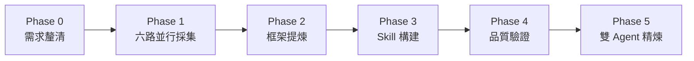

# 女媧 Nuwa Skill

[[AI 101 - 主頁|← 回主頁]]

> [!info]
> GitHub：[alchaincyf/nuwa-skill](https://github.com/alchaincyf/nuwa-skill)
> 核心概念：**「你想蒸餾的下一個員工，何必是同事」**
> 授權：MIT

---

## 什麼是女媧

一個 Claude Code Skill，用來「蒸餾」任何公眾人物的**思維方式**，轉化為可以對話的認知框架。

> [!tip] 關鍵區別
> 女媧捕捉的是「**他們如何思考**」，而不是「他們說了什麼」。
> 結果是一個可以運作的心智模型，而非知識問答機器人。

---

## 安裝

```bash
npx skills add alchaincyf/nuwa-skill
```

安裝完成後，在 Claude Code 對話中即可使用。

---

## 怎麼用

### 觸發詞（任一皆可）

```
造skill
蒸餾 XX
女媧
造人
XX 的思維方式
更新 XX 的 skill
```

### 使用範例

```
蒸餾一個保羅·格雷厄姆
```
→ 女媧會自動執行六路並行採集，最終產出 Paul Graham 的思維 Skill

```
用芒格的視角幫我分析這個投資決策
```
→ 呼叫已有的芒格 Skill，用他的思維框架回答

---

## 運作原理（五個 Phase）



### Phase 1：六路並行採集

用六個 subagent 同時從不同角度蒐集資料：

| Agent | 採集內容 |
|---|---|
| 著作 Agent | 書籍、文章、演講 |
| 對話 Agent | 訪談、播客 |
| 表達 Agent | 社交媒體、用詞習慣 |
| 他者視角 Agent | 批評、評論、傳記 |
| 決策 Agent | 重大決策案例 |
| 時間線 Agent | 思想演變軌跡 |

> [!warning] 禁用資訊源
> 知乎、微信公眾號、百度百科永遠不用。
> 一手來源佔比必須 > 50%。

### Phase 2：框架提煉

從採集資料中萃取：
- **心智模型**（3–7 個，每個需有來源證據）
- **決策啟發式**（他遇到問題時怎麼思考）
- **表達 DNA**（100 字內能認出是誰的語感）
- **反模式**（他明確反對什麼）

> [!info] 保留內在矛盾
> 觀點矛盾不強行調和——矛盾本身有價值，是人物立體感的來源。

### Phase 3：Skill 構建

整合成一個可執行的 Skill 檔案，包含：
- 核心世界觀
- 決策流程
- 典型回應風格

### Phase 4：品質驗證

| 驗證項目 | 標準 |
|---|---|
| 心智模型數量 | 3–7 個，每個有來源 |
| 表達辨識度 | 100 字內能認出是誰 |
| 一手來源比例 | > 50% |
| 內在矛盾 | ≥ 2 對 |
| 誠實邊界 | ≥ 3 條具體局限說明 |

### Phase 5：雙 Agent 精煉

一個 Agent 扮演該人物，另一個挑戰它，反覆優化直到通過。

---

## 已內建的人物 Skill

安裝後可直接呼叫：

| 人物 | 領域 |
|---|---|
| Paul Graham | 創業、寫作 |
| Andrej Karpathy | AI 研究 |
| Ilya Sutskever | AI 研究 |
| Elon Musk | 科技創業 |
| Steve Jobs | 產品設計 |
| Charlie Munger（芒格）| 投資、思維 |
| Naval Ravikant | 創業、財富哲學 |
| Richard Feynman | 物理、學習方法 |
| Nassim Taleb | 風險、反脆弱 |
| Zhang Yiming（張一鳴）| 科技創業 |
| MrBeast | 內容創作 |
| Trump | 談判、政治 |
| 張雪峰 | 教育、升學 |
| 孫宇晨 | 加密貨幣 |

---

## 特殊模式

### 更新已有 Skill

```
更新芒格的 skill
```
只增量更新最新資訊（對話 + 決策 + 時間線），不重寫全部。

### 主題 Skill（非人物）

```
蒸餾「價值投資」這個主題
```
用流派對比替代人物視角，呈現框架共識與各家分歧。

### 冷門人物

資訊源 < 10 條時女媧會提前告知，心智模型縮減至 2–3 個。

---

## 相關筆記

- [[AI 101 - Claude Code 生態系]] — Skills 概念說明
- [[AI 101 - Harness Engineering]] — 多 Agent 並行架構原理
